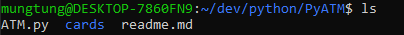
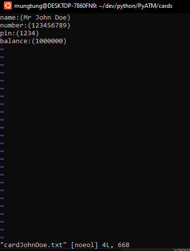

# Cards
---
- Cards are stored in the cards directory, directly below the ATM.py file.

 
- They are stored as .txt files and formatted as such:
 

 
The parameters are as follows:
name: The name of the cardholder.
number: The "ID" of the card
pin: The card's pin 
balance: The amount of money in the actual account

The values in the text file changed based on your input while the program is running, just like a real ATM would.

# Future features
---
- ATMs will lock your card if there are too many failed attempts and you will have to contact your ATM provider (me) to have them unlocked for security reasons.
- The cards will no longer be stored in plaintext but will be fed through a quantum computer to encrypt the data and make them extremely secure. (however at this point your data is lost to all)
- AI integration, Node.js, VsCode extension. 
